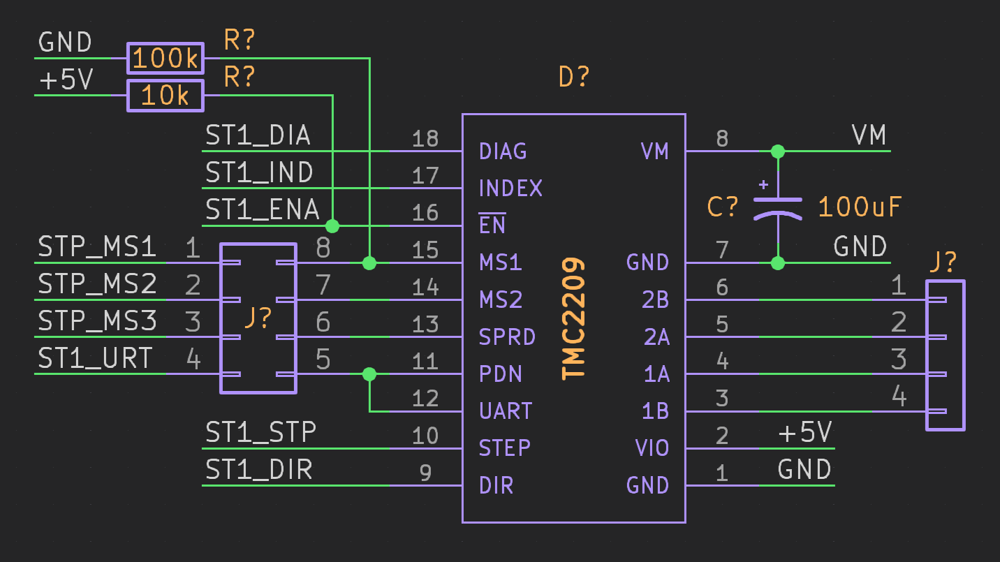
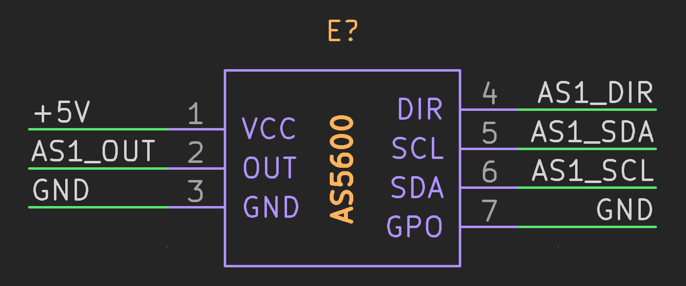

# Hardware

## Fritzing Circuit
The Fritzing circuit `electrocal\fritzing` includes various components for prototyping and visualization, such as temperature and humidity sensors, current sensors, and IMUs, all interconnected with the Arduino Giga board.

1. Adafruit AHT20 Temperature and Humidity Sensor
2. Adafruit INA219 Current Sensor FeatherWing
3. Adafruit INA219
4. Adafruit LSM6DS33 6-DoF Accel + Gyro IMU
5. Arduino-GIGA-R1-WIFI
6. AS5600 module
7. BMI160 breakout
8. Raspberry-Pi5
9. Seeed Wio E5
10. TMC2209 Bigtree

## Ki-Cad Projects

### GIGA Board - giga.kicad_pro

- DC Motor & 2-CH Encoder - Signal Pins
    DCx_PWM, DCx_
-  TMC2209 MakerBase
    

- AS5600 Module
    

### Power Board - pdb.kicad_pro

# Firware

### Stepper Motor Control with AS5600 Encoder

system that continuously moves the motor while displaying the encoder count. The setup uses an Arduino board with the AccelStepper library for motor control and interrupt-driven encoder reading for accurate feedback
- AccelStepper.h
- AS5600.h